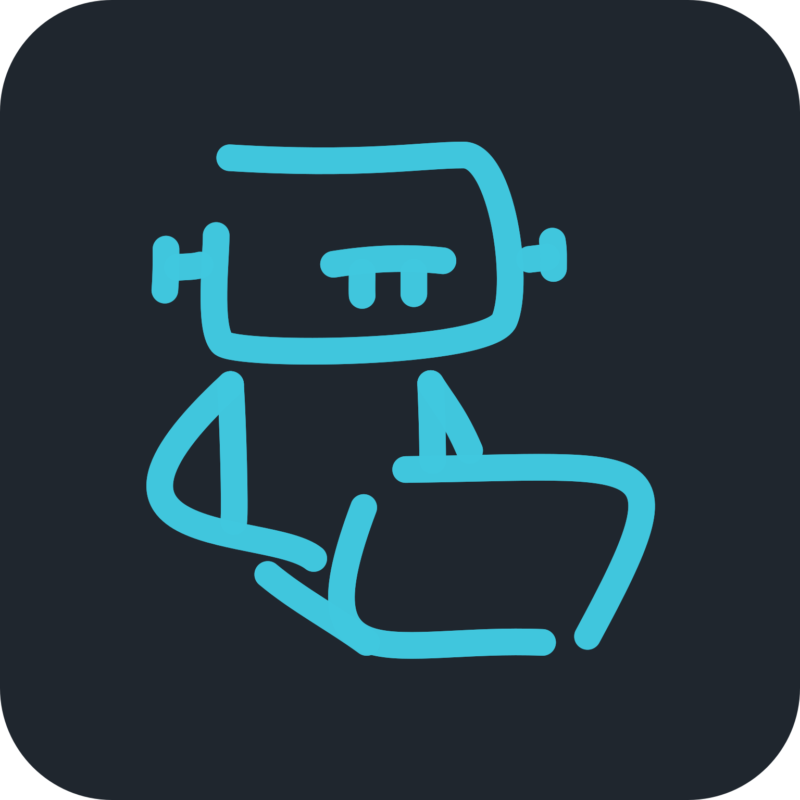

# CoAgent- Cross-Agent CLI Bridge for Model Context Protocol (MCP)

<p align="center">
  
</p>

CoAgentexposes local coding CLIs through a stdio MCP server. An agent in a
compatible MCP host can ask Codex, Claude Code or Antigravity (`agy`, the Gemini
adapter) for help and receive public output through a read-only execution profile.
Use **CoAgentReview** to get an independent code review from a separate agent in a read-only sandbox.

The current package is `1.0.0-beta.1`; this version label is not release approval.
Releases follow beta 1, beta 2, release candidates and then 1.0.0; see the
[release sequence](docs/ROADMAP.md#release-sequence).
The [roadmap](docs/ROADMAP.md) prioritizes quiet Windows operation, ordinary MCP
use and a smaller execution path. `consult` returns plain answers; optional
durable history is a planned change, not a current runtime option.

> **Known issues.** An [independent audit](docs/PROJECT_REVIEW_2026-10-05.md#independent-audit-at-c265cdf)
> of `c265cdf` found release blockers:
> - Windows process teardown can match unrelated processes through stale parent PIDs.
> - Secret redaction rewrites ordinary code in answers.
> - Long streamed answers can fill the history archive and block executions.
>
> See the [runtime contract's known deviations](docs/RUNTIME_CONTRACT.md#7-known-deviations-audit-at-c265cdf)
> and the [roadmap](docs/ROADMAP.md#audit-remediation-index).

## Connect through MCP

Use Node.js 20+ and at least one separately installed/authenticated backend CLI.
The **host** runs the chat and connects to CoAgent; the **backend** CLI performs
the requested task. Installing one does not configure or authenticate the other.
Claude Code runs in restricted read-only print mode (`--restricted`, tools
`Read,Glob,Grep`), works with a claude.ai subscription login or an API key, and
supports native resume and public event streaming. It requires Claude Code 2.1.259
or later.

To build a local checkout:

```bash
npm ci
npm run build
```

Add a stdio server definition to your host's MCP configuration. The following
JSON shape is used by many hosts; follow your host's configuration format:

```json
{
  "mcpServers": {
    "coagent8": {
      "command": "node",
      "args": ["<absolute-path-to-coagent8>/dist/index.cjs"]
    }
  }
}
```

No setup command, recognized client name or VSIX is required for this path.
CoAgent advertises tools independently of the calling client's name. Backend
availability is checked when executing tasks or explicit diagnostics. Specify
`backend` on a call, or configure `defaultBackend`; auto selection with multiple
eligible backends and no configured default requires a choice.

The backend executables resolve from PATH. Set `CODEX_PATH`, `CLAUDE_PATH`, or
`GEMINI_PATH`/`AGY_PATH` in the server environment for custom locations. Supply
`workspace_path` to execution tools when the host's process directory is not the
project to inspect.

For a locally built package, `npm pack` creates a tarball that can be installed
with `npm install --omit=dev <tarball-path>`. Both `coagent8` and `coagent8-mcp`
start the stdio server with no arguments. A published registry version can also
be launched with `npx -y coagent8@<published-version>`; registry availability is
not established by the version in this checkout.

### Continue

Continue accepts stdio MCP definitions and exposes MCP tools in Agent mode. Its
absence from CoAgent's setup-client list is not a server compatibility block.
For example, merge this block into the active Continue configuration:

```yaml
mcpServers:
  - name: CoAgent
    type: stdio
    command: node
    args:
      - "<absolute-path-to-coagent8>/dist/index.cjs"
```

Follow [Continue's MCP guide](https://docs.continue.dev/customize/deep-dives/mcp)
for configuration placement and standalone-file metadata. This configuration is
based on the documented protocol path; real Continue UI acceptance is still open
in the roadmap. Each host controls tool visibility, approval, refresh and icons.

### Optional setup and editor integrations

The CLI provides `setup`, `repair` and `status` for selected local-default Codex,
Claude Code and agy host profiles. The VS Code extension registers its native MCP
provider and offers the same optional setup flow. These conveniences do not define
the list of compatible MCP clients. See the [integration guide](docs/VSCODE_INTEGRATION.md)
for installation, ownership, rollback and current host-verification limits.

## Current tools

| Tool | Purpose |
| --- | --- |
| consult | Second opinion with a plain answer; optional `task_type` (`architecture`, `debug`, `implementation`) |
| review | CoAgent Review: Git diff review with a structured audit envelope |
| doctor | Backend installation, version, quota/cooldown and authentication evidence |
| session | List, read history or close sessions |
| cancel | Cancel a session's active execution |
| issue | Generate a sanitized report and issue link |
| analyze, debug, implement | Deprecated aliases of `consult` with the matching `task_type` |

The default canonical profile advertises these six tools and the three deprecated
aliases. Setting `"toolProfile": "compact"` in `~/.coagent8/config.json` advertises
`run`, `doctor`, `session` and `cancel`; run dispatches task actions and issue reporting.

Example consult arguments:

```json
{
  "proposal": "Review the trade-offs of this design",
  "backend": "codex",
  "workspace_path": "<absolute-path-to-project>"
}
```

Execution responses include structured status and, where available, a session
handle for continuation. Read-only profiles, explicit top-tier model consent,
secret redaction, bounded buffers and owned-process cleanup apply. See the
[runtime contract](docs/RUNTIME_CONTRACT.md) for options, errors, history and limits.
A model-generated review verdict does not establish independently verified results.

## Documentation and contributing

| Need | Document |
| --- | --- |
| Implementation priorities and acceptance | [Roadmap](docs/ROADMAP.md) |
| Current component responsibilities | [Architecture](docs/ARCHITECTURE.md) |
| Current protocol and execution behavior | [Runtime contract](docs/RUNTIME_CONTRACT.md) |
| Audit findings, evidence and historical reviews | [Project review](docs/PROJECT_REVIEW_2026-10-05.md) |
| Optional VSIX, plugin and client setup | [Integration guide](docs/VSCODE_INTEGRATION.md) |
| Contributor rules | [AGENTS.md](AGENTS.md) |
| Branches, commits, pull requests and releases | [Git workflow](.agents/rules/02-git-workflow.md) |
| Release history | [Changelog](CHANGELOG.md) |
| Local checks by change scope | [Quality gate](.agents/rules/04-quality-gate.md) |
| TSDoc and generated API reference | [Code documentation](docs/CODE_DOCUMENTATION.md) |

Prose-only edits require content/link review and diff checks, not runtime tests.
Code changes require relevant verification; releases require full package and
cross-platform validation. The quality-gate rule is the authoritative checklist.
The current CI still runs its full matrix; scoped CI and quieter Windows test
fixtures remain implementation work tracked in the roadmap.

---

## 📄 License

Copyright (c) 2026 Oktawian Wybieralski (oki.dev).

CoAgent is licensed under the [GNU General Public License, version 3 only](LICENSE)
(`GPL-3.0-only`). You may use, modify, and redistribute it, including commercially,
under the terms of that license. Distributed derivative works must remain under
GPLv3, with the corresponding source code made available as required by the license.
CoAgent is provided without any warranty; see [LICENSE](LICENSE) for the full terms.

Copies previously distributed under the MIT License remain available under those terms.

Created by [Oktawian Wybieralski](https://oki.dev) · [GitHub Repository](https://github.com/oktawianwybieralski/coagent8)
