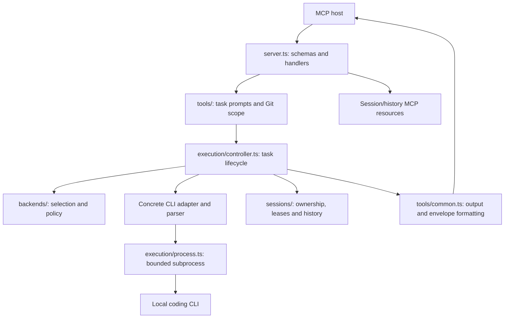

# CoAgent architecture

This document describes the current implementation. [ROADMAP.md](ROADMAP.md)
owns the proposed simplification and migration sequence; [RUNTIME_CONTRACT.md](RUNTIME_CONTRACT.md)
owns tool schemas, execution guarantees and storage behavior.

CoAgent is a stdio MCP bridge to local read-only CLI backends. The calling host
and executing backend are separate roles. Server tool discovery does not check
client names. The setup command's recognized-client list belongs to optional
registration automation, not the MCP compatibility boundary.

## Current request path

| Owner | Current responsibility |
| --- | --- |
| src/index.ts | Dispatch explicit setup commands or connect stdio and start background session pruning; coordinate shutdown |
| src/server.ts, src/tools/ | Advertise profiles, validate requests, build prompts/diffs, serve resources and format responses |
| src/execution/ | Coordinate turns, progress and cancellation; supervise subprocesses; collect bounded streams and Git context |
| src/backends/ | Concrete registry, CLI resolution, native parsers, policy, routing and observed cooldowns |
| src/sessions/ | Workspace/provider identity, native continuation records, turn leases, locks, history and pagination |
| src/integrations/ | Optional host setup/repair, bounded RPC probes and VS Code registration detection |
| src/diagnostics/ | Backend evidence and sanitized issue reports |
| Config, paths, redaction | Named shared configuration, storage paths and privacy behavior |
| extensions/vscode/ | Native MCP provider and optional shared setup UI |

## Coupling that remains

The [independent audit at c265cdf](PROJECT_REVIEW_2026-10-05.md#independent-audit-at-c265cdf)
found boundary defects in the current implementation. The
[roadmap](ROADMAP.md#audit-remediation-index) tracks their removal.

Every task currently acquires a session and uses the history writer. History
flushes occur during execution, and the first flush runs before the CLI starts.
History, session-metadata or lease-release failures can mark a successful result
failed or prevent execution (AUD-P0-3, AUD-P1-3). Session pruning runs in the
background after the transport connects. Making archival history optional must
not weaken ownership or turn mutual exclusion.

`execution/controller.ts` owns turn execution, but it also writes archive
records, session metadata and rate-limit cooldowns inside the same error path.
The result: one cooldown is written twice (AUD-P1-1), and failures in
bookkeeping are reported as execution failures. Errors cross module boundaries as
`CODE: message` strings that `server.ts` parses back (AUD-P1-2).

Review requests the State Envelope and the server gates its format; consult
returns a plain answer with `verdict: "NOT_APPLICABLE"`. The envelope gate is
application policy, not an MCP requirement or proof of test execution.

Routing probes backends before every execution, and some adapters repeat
capability/version probes inside `execute` (AUD-P1-4). Windows runCommand uses
descendant tracking for short probes as well as long tasks. Polling starts
PowerShell CIM queries, and the test runner and MCP harness also start trackers.
Descendants are currently identified by parent PID alone, so teardown can match
unrelated processes whose parent PID is stale (AUD-P0-1). Reducing this work
requires preserving process-tree ownership and cancellation, including when
intermediate ancestors have exited, and identifying processes by PID plus
creation time.

Secret redaction is shared between diagnostics and public answers, so
diagnostic keyword rules also rewrite code in model answers (AUD-P0-2). MCP
resources list and read sessions across workspaces while the `session` tool
enforces workspace ownership (AUD-P1-8).

Setup is dispatched only by explicit CLI subcommands, although it is imported
through the same entrypoint and bundled with the runtime, together with its TOML
and JSONC parsers (AUD-P2-10). It maintains selected
hosts, runtime copies, backups and registration fingerprints. Existing safeguards
remain necessary for commands that write another application's configuration.
The VSIX offers setup separately from its native provider registration.

## Target boundary

### Names define responsibility

Use conventional TypeScript/MCP organization with clearly named owners. A
directory, module, class or function must not perform work outside the scope
described by its name. Names are boundaries, not labels applied after unrelated
behavior has accumulated.

An owner may call another owner's public interface to complete its operation;
it must not absorb or duplicate that owner's logic. For example, a tool handler
delegates task execution, an adapter delegates process supervision, and a session
manager delegates archival persistence. Those calls do not make the caller the
owner of process management or archive storage. Response formatting must not
write routing state or install host registrations.

When scope and name disagree, move the misplaced behavior, split the mixed
responsibility, or rename a coherent owner precisely. Broad names such as common
or utils do not authorize arbitrary responsibilities. Audit the existing layout
against this rule during the roadmap's refactors; no source migration is implied
by this documentation change.

### Execution boundary

The core remains MCP request -> execution -> concrete adapter -> supervised CLI
-> public result. Optional host installation, durable archives and strict audit
formatting must not become prerequisites for an ordinary consultation. No generic
plugin framework, new database or additional controller/repository hierarchy is
required by this target.

Preserve read-only execution, model consent, redaction, bounds, typed failures,
session ownership and cleanup. Cleanup terminates only processes whose identity
(PID plus creation time) proves ownership. Redaction protects credentials
without altering the content of public answers. Optional bookkeeping (archive,
cooldown cache, session metadata) reports warnings and never changes an
execution's outcome. Public names, configuration, stored histories and
registration ownership need explicit migration when their contracts change.
Acceptance belongs in the roadmap rather than a second architecture checklist.
